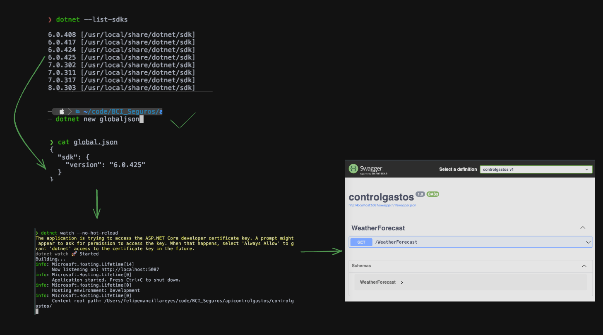

## Dotnet and Angular CLI Cheat Sheet

## Warning just if on Linux or mac show errors with omnisharp on NeoVim/LazyVim
```bash
sudo apt update
sudo apt install mono-complete
```
Or on Mac
```bash
brew install mono
```
```bash
# Download the latest version of omnisharp-roslyn
git clone https://github.com/OmniSharp/omnisharp-roslyn.git
cd omnisharp-roslyn
./build.sh
```

### Install dotnet with differents version on Linux , exaple with 6 and 8 version

```bash
mkdir ~/.dotnet
```
```bash
wget https://builds.dotnet.microsoft.com/dotnet/Sdk/8.0.408/dotnet-sdk-8.0.408-linux-x64.tar.gz
tar -zxf dotnet-sdk-8.0.408-linux-x64.tar.gz -C ~/.dotnet
```

```bash
wget https://builds.dotnet.microsoft.com/dotnet/Sdk/6.0.425/dotnet-sdk-6.0.425-linux-x64.tar.gz
tar -zxf dotnet-sdk-6.0.425-linux-x64.tar.gz -C ~/.dotnet
```
```bash
dotnet --list-sdks
```
In yout .zshrc or .bashrc put this
```
export DOTNET_ROOT=$HOME/.dotnet
export PATH=$HOME/.dotnet:$PATH
```
Next put this on your terminal to reload the config 
```
source ~/.zshrc
```
or
```
source ~/.bashrc
```

 ### If you have a trouble with your certs on Linux use this

in your .zshrc or bashrc put this, that use the major version of dotnet, example if you use 6 and 8 of SDKs versions
```bash
export DOTNET_ROLL_FORWARD=Major
```

```bash
dotnet tool update -g linux-dev-certs
dotnet linux-dev-certs install

dotnet dev-certs https --clean
dotnet dev-certs https --trust
```

### Example Project Setup with DOTNET 8.03

```bash

mkdir DatingApp   
cd DatingApp  

# Create a new solution file in the current directory. This command initializes a new .NET solution file (.sln) that will contain one or more projects.
dotnet new sln -n API

# Create a new Web API project named API with controllers. This command generates a new Web API project with the specified name API and includes support for controllers.
dotnet new webapi -controllers -n API    

# List all projects in the solution. This command shows all the projects that are currently included in the solution file.
dotnet sln list 

# Add the API project to the solution. This command includes the API project into the solution file, allowing it to be managed and built as part of the solution.
dotnet sln API.sln add API/API.csproj

dotnet sln list


# Build and run the API project. This command compiles and executes the API project, starting the Web API application.
dotnet run

# Run the project and watch for file changes. This command runs the project and automatically restarts it if any source files are modified, which is useful for development and debugging.

dotnet watch
# Or watch --no-hot-reload
dotnet watch --no-hot-reload
```
### Commands

- Create a new .NET project.
```bash
dotnet new
```

- List new command options. The Short Name column has templates to use. Example:
```bash
dotnet new webapi -controllers -n API
```

- Restore dependencies specified in the project.
```bash
dotnet restore
```

- Build a project and all of its dependencies.
```bash
dotnet build
```

- Build and run a project.
```bash
dotnet run
```
- Build and run a project on specific/different port.

```bash
dotnet run --urls "http://127.0.0.1:<new-port>"
```

- Run unit tests using a test runner specified in the project.
```bash
dotnet test
```

- Entity Framework Core command-line tools.
```bash
dotnet ef
```

- .NET Core global tools command-line.
```bash
dotnet tool
```

- Clean the output of a project.
```bash
dotnet clean
```
- Use [NuGet](https://www.nuget.org/).
- NuGet command-line.
```bash
dotnet nuget
```
- Create a NuGet package.
```bash
dotnet pack
```

- Publish a .NET project.
```bash
dotnet publish
```

- Migrate a project from project.json to csproj.
```bash
dotnet migrate
```

- Modify solution (SLN) files.
```bash
dotnet sln
```


- List all available project templates.
```bash
dotnet new --list
```

- Display help information for a command.
```bash
dotnet help
```

- Display information about the installed .NET Core SDK.
```bash
dotnet --info
```

- Create/Recreate certs.
```bash
dotnet dev-certs https
```

- Trust certs.
```bash
dotnet dev-certs https --trust
```

- Clean certs.
```bash
dotnet dev-certs https --clean
```

- Entity Framework Core .NET Command-line Tools 8.0.3, with dotnet-ef tool.
```bash
dotnet tool list -g
```

- Install dotnet-ef. Ensure it is the same version as your dotnet.
```bash
dotnet tool install --global dotnet-ef --version 8.0.3
```


- To view a help page of migrations.
```bash
dotnet ef migrations -h
```

- To use.
```bash
dotnet ef
```

- To create a InitialCreate Migration and Path, remember to use `cd API` before.
```bash
dotnet ef migrations add InitialCreate -o Data/Migrations
```
- To Next migrations just need add the name  
```bash
dotnet ef migrations add UserEntityUpdated
```
- To undo this action
```bash
dotnet ef migrations remove
```

- To see the help options on databases.
```bash
dotnet ef database -h
```

- To activate migrations.
```bash
dotnet ef database update
```

- To delete/drop database
```bash
dotnet ef database drop
```

- To uninstall dotnet-ef.
```bash
dotnet tool uninstall --global dotnet-ef
```

- To create a .gitignore template file.
```bash
dotnet new gitignore
```

### Help Examples
- General help.
```bash
dotnet -h
```

- Help for webapi.
```bash
dotnet new webapi -h
```

- Help for subcommand webapi. Example usage: `dotnet new webapi -controllers -n API`
```bash
dotnet new webapi -controllers -h
```
- ADD New package
```bash
dotnet add package Microsoft.AspNetCore.Authentication.JwtBearer
```
- Watch with no hot reaload
```bash
 dotnet watch --no-hot-reload
```

**WORK With differents SDK versions**

- List of vesions of SDK
```bash
dotnet --list-sdks
```
```bash
dotnet --version
```

When we install each dotnet core SDK on OS, the each project can use SDKs version separately. Because the SDK have global installation. We can configuration each project settings by create global.json via this command:
```bash
dotnet new globaljson --force
```
- Edit the version from dotnet --list-sdks
```bash
vim global.json
```

and finally selected the correct version.

The process for selecting an SDK version is:

dotnet searches for a **global.json** file iteratively reverse-navigating the path upward from the current working directory.
dotnet uses the SDK specified in the first **global.json** found.
dotnet uses the latest installed SDK if no **lobal.json** is found.

References: https://learn.microsoft.com/en-us/dotnet/core/tools/global-json?tabs=netcore3x#globaljson-and-the-net-core-cli

Step-by-Step: https://stackoverflow.com/a/42078060/14557383


## Example usin dotnet CLI with in version 6 usin differents versions on global.json
```bash
dotnet new webapi -n Api --no-https 
```

## Example usin dotnet CLI with in version 8 and controllers template
```bash
dotnet new webapi -controllers -n Api
```
## Example Create a Manual Solution file 
```bash
dotnet new sln -n Api

mkdir Api.Api
mkdir Api.Tests
mkdir Api.IntegrationTests

cd Api.Api
dotnet new webapi
cd ..

cd Api.Tests
dotnet new xunit
cd ..

cd Api.IntegrationTests
dotnet new xunit
cd ..
```

```bash
dotnet sln Api.sln add Api.Api/Api.Api.csproj
dotnet sln Api.sln add Api.Tests/Api.Tests.csproj
dotnet sln Api.sln add Api.IntegrationTests/Api.IntegrationTests.csproj

cd Api.Tests
dotnet add reference ../Api.Api/Api.Api.csproj
cd ..

cd Api.IntegrationTests
dotnet add reference ../Api.Api/Api.Api.csproj
cd ..
```





# Jupyter Notebooks with .NET and C#


### Setup Jupyter for C# locally

- Latest dotnet 5.0+ SDK
- Python 3.7+ with pip
### Install jupyterlab to default Python interpreter
```bash
pip install jupyterlab
```
### Install Dotnet Interactive dotnet tool

```bash
dotnet tool install -g Microsoft.dotnet-interactive
```
### Get Dotnet Interactive to register kernels with Jupyter  

```bash
dotnet interactive jupyter install
```
```bash
jupyter kernelspec list
```
```bash
jupyter lab build   
```
```bash
jupyter-lab
```

## Alternative using X Tool on NET CLI 
```bash
dotnet tool install --global x
```
```bash
dotnet tool update -g x
```
```bash
x jupyter-csharp
```
```bash
x jupyter-csharp <a href="https://techstacks.io">https://techstacks.io</a> FindTechStacks "{Ids:[1,2,3],VendorName:'Google',Take:5}"
```
### Output example: 
Saved to: techstacks.io-FindTechStacks.ipynb

Source: https://docs.servicestack.net/jupyter-notebooks-csharp#generate-c-jupyter-notebooks


## Test en Dotnet 

## 🚀 Setup Inicial

### Crear proyecto de pruebas
```bash
# Crear proyecto de pruebas xUnit
dotnet new xunit -n MiApp.Tests

# Crear proyecto de pruebas NUnit
dotnet new nunit -n MiApp.Tests

# Crear proyecto de pruebas MSTest
dotnet new mstest -n MiApp.Tests

# Agregar referencia al proyecto principal
dotnet add MiApp.Tests reference MiApp/MiApp.csproj

# Restaurar dependencias
dotnet restore
```

### Estructura de carpetas recomendada
```
MiSolucion/
├── src/
│   └── MiApp/
├── tests/
│   ├── MiApp.UnitTests/
│   ├── MiApp.IntegrationTests/
│   └── MiApp.AcceptanceTests/
└── MiSolucion.sln
```

## 🧪 Frameworks de Testing

### xUnit (Recomendado)
```xml
<PackageReference Include=\"Microsoft.NET.Test.Sdk\" Version=\"17.8.0\" />
<PackageReference Include=\"xunit\" Version=\"2.4.2\" />
<PackageReference Include=\"xunit.runner.visualstudio\" Version=\"2.4.5\" />
<PackageReference Include=\"Moq\" Version=\"4.20.69\" />
<PackageReference Include=\"FluentAssertions\" Version=\"6.12.0\" />
```

### NUnit
```xml
<PackageReference Include=\"Microsoft.NET.Test.Sdk\" Version=\"17.8.0\" />
<PackageReference Include=\"NUnit\" Version=\"3.14.0\" />
<PackageReference Include=\"NUnit3TestAdapter\" Version=\"4.5.0\" />
```

### MSTest
```xml
<PackageReference Include=\"Microsoft.NET.Test.Sdk\" Version=\"17.8.0\" />
<PackageReference Include=\"MSTest.TestFramework\" Version=\"3.1.1\" />
<PackageReference Include=\"MSTest.TestAdapter\" Version=\"3.1.1\" />
```

## 📚 Conceptos Fundamentales

### Patrón AAA (Arrange, Act, Assert)
```csharp
[Test]
public void DeberiaCalcularElTotalCorrectamente()
{
    // Arrange - Preparar datos y dependencias
    var calculadora = new Calculadora();
    var numero1 = 5;
    var numero2 = 3;
    
    // Act - Ejecutar la acción que queremos probar
    var resultado = calculadora.Sumar(numero1, numero2);
    
    // Assert - Verificar el resultado
    Assert.Equal(8, resultado);
}
```

### Convención de nombres
```csharp
// Patrón: MetodoQuePrueba_Escenario_ResultadoEsperado
[Test]
public void Sumar_ConDosNumerosPositivos_DeberiaRetornarLaSuma() { }

[Test]
public void Dividir_PorCero_DeberiaLanzarExcepcion() { }

[Test]
public void ObtenerUsuario_UsuarioNoExiste_DeberiaRetornarNull() { }
```

## 🎯 Ejemplos Prácticos

### 1. Testing de Clase Simple
```csharp
// Clase a testear
public class Calculadora
{
    public int Sumar(int a, int b) => a + b;
    
    public double Dividir(double a, double b)
    {
        if (b == 0) throw new DivideByZeroException();
        return a / b;
    }
    
    public bool EsPar(int numero) => numero % 2 == 0;
}

// Tests
public class CalculadoraTests
{
    private readonly Calculadora _calculadora;
    
    public CalculadoraTests()
    {
        _calculadora = new Calculadora();
    }
    
    [Fact]
    public void Sumar_ConDosNumerosPositivos_DeberiaRetornarLaSuma()
    {
        // Arrange
        var a = 5;
        var b = 3;
        
        // Act
        var resultado = _calculadora.Sumar(a, b);
        
        // Assert
        resultado.Should().Be(8);
    }
    
    [Theory]
    [InlineData(4, true)]
    [InlineData(5, false)]
    [InlineData(0, true)]
    [InlineData(-2, true)]
    public void EsPar_ConDiferentesNumeros_DeberiaRetornarResultadoCorrecto(int numero, bool esperado)
    {
        // Act
        var resultado = _calculadora.EsPar(numero);
        
        // Assert
        resultado.Should().Be(esperado);
    }
    
    [Fact]
    public void Dividir_PorCero_DeberiaLanzarExcepcion()
    {
        // Arrange
        var a = 10.0;
        var b = 0.0;
        
        // Act & Assert
        Action action = () => _calculadora.Dividir(a, b);
        action.Should().Throw<DivideByZeroException>();
    }
}
```

### 2. Testing con Mocks (Moq)
```csharp
// Interfaces y servicios
public interface IRepositorioUsuario
{
    Usuario ObtenerPorId(int id);
    void Guardar(Usuario usuario);
}

public class ServicioUsuario
{
    private readonly IRepositorioUsuario _repositorio;
    
    public ServicioUsuario(IRepositorioUsuario repositorio)
    {
        _repositorio = repositorio;
    }
    
    public bool ActivarUsuario(int usuarioId)
    {
        var usuario = _repositorio.ObtenerPorId(usuarioId);
        if (usuario == null) return false;
        
        usuario.Activo = true;
        _repositorio.Guardar(usuario);
        return true;
    }
}

// Tests con Mocks
public class ServicioUsuarioTests
{
    private readonly Mock<IRepositorioUsuario> _mockRepositorio;
    private readonly ServicioUsuario _servicio;
    
    public ServicioUsuarioTests()
    {
        _mockRepositorio = new Mock<IRepositorioUsuario>();
        _servicio = new ServicioUsuario(_mockRepositorio.Object);
    }
    
    [Fact]
    public void ActivarUsuario_UsuarioExiste_DeberiaActivarYRetornarTrue()
    {
        // Arrange
        var usuarioId = 1;
        var usuario = new Usuario { Id = usuarioId, Activo = false };
        
        _mockRepositorio.Setup(r => r.ObtenerPorId(usuarioId))
                       .Returns(usuario);
        
        // Act
        var resultado = _servicio.ActivarUsuario(usuarioId);
        
        // Assert
        resultado.Should().BeTrue();
        usuario.Activo.Should().BeTrue();
        _mockRepositorio.Verify(r => r.Guardar(usuario), Times.Once);
    }
    
    [Fact]
    public void ActivarUsuario_UsuarioNoExiste_DeberiaRetornarFalse()
    {
        // Arrange
        var usuarioId = 999;
        _mockRepositorio.Setup(r => r.ObtenerPorId(usuarioId))
                       .Returns((Usuario)null);
        
        // Act
        var resultado = _servicio.ActivarUsuario(usuarioId);
        
        // Assert
        resultado.Should().BeFalse();
        _mockRepositorio.Verify(r => r.Guardar(It.IsAny<Usuario>()), Times.Never);
    }
}
```

### 3. Testing Asíncrono
```csharp
// Servicio asíncrono
public class ServicioApiExterna
{
    private readonly HttpClient _httpClient;
    
    public ServicioApiExterna(HttpClient httpClient)
    {
        _httpClient = httpClient;
    }
    
    public async Task<string> ObtenerDatosAsync(string endpoint)
    {
        var response = await _httpClient.GetAsync(endpoint);
        response.EnsureSuccessStatusCode();
        return await response.Content.ReadAsStringAsync();
    }
}

// Tests asíncronos
public class ServicioApiExternaTests
{
    private readonly Mock<HttpMessageHandler> _mockHandler;
    private readonly HttpClient _httpClient;
    private readonly ServicioApiExterna _servicio;
    
    public ServicioApiExternaTests()
    {
        _mockHandler = new Mock<HttpMessageHandler>();
        _httpClient = new HttpClient(_mockHandler.Object);
        _servicio = new ServicioApiExterna(_httpClient);
    }
    
    [Fact]
    public async Task ObtenerDatos_RespuestaExitosa_DeberiaRetornarContenido()
    {
        // Arrange
        var endpoint = \"/api/datos\";
        var contenidoEsperado = \"datos de prueba\";
        
        _mockHandler.Setup(h => h.SendAsync(
            It.Is<HttpRequestMessage>(req => req.RequestUri.ToString().Contains(endpoint)),
            It.IsAny<CancellationToken>()))
            .ReturnsAsync(new HttpResponseMessage
            {
                StatusCode = HttpStatusCode.OK,
                Content = new StringContent(contenidoEsperado)
            });
        
        // Act
        var resultado = await _servicio.ObtenerDatosAsync(endpoint);
        
        // Assert
        resultado.Should().Be(contenidoEsperado);
    }
}
```

### 4. Testing de Controllers (ASP.NET Core)
```csharp
[ApiController]
[Route(\"api/[controller]\")]
public class UsuariosController : ControllerBase
{
    private readonly IServicioUsuario _servicioUsuario;
    
    public UsuariosController(IServicioUsuario servicioUsuario)
    {
        _servicioUsuario = servicioUsuario;
    }
    
    [HttpGet(\"{id}\")]
    public async Task<IActionResult> ObtenerUsuario(int id)
    {
        var usuario = await _servicioUsuario.ObtenerPorIdAsync(id);
        if (usuario == null) return NotFound();
        
        return Ok(usuario);
    }
    
    [HttpPost]
    public async Task<IActionResult> CrearUsuario([FromBody] CrearUsuarioRequest request)
    {
        if (!ModelState.IsValid) return BadRequest(ModelState);
        
        var usuario = await _servicioUsuario.CrearAsync(request);
        return CreatedAtAction(nameof(ObtenerUsuario), new { id = usuario.Id }, usuario);
    }
}

// Tests del Controller
public class UsuariosControllerTests
{
    private readonly Mock<IServicioUsuario> _mockServicio;
    private readonly UsuariosController _controller;
    
    public UsuariosControllerTests()
    {
        _mockServicio = new Mock<IServicioUsuario>();
        _controller = new UsuariosController(_mockServicio.Object);
    }
    
    [Fact]
    public async Task ObtenerUsuario_UsuarioExiste_DeberiaRetornarOk()
    {
        // Arrange
        var usuarioId = 1;
        var usuario = new Usuario { Id = usuarioId, Nombre = \"Juan\" };
        
        _mockServicio.Setup(s => s.ObtenerPorIdAsync(usuarioId))
                    .ReturnsAsync(usuario);
        
        // Act
        var resultado = await _controller.ObtenerUsuario(usuarioId);
        
        // Assert
        var okResult = resultado.Should().BeOfType<OkObjectResult>().Subject;
        okResult.Value.Should().Be(usuario);
    }
    
    [Fact]
    public async Task ObtenerUsuario_UsuarioNoExiste_DeberiaRetornarNotFound()
    {
        // Arrange
        var usuarioId = 999;
        _mockServicio.Setup(s => s.ObtenerPorIdAsync(usuarioId))
                    .ReturnsAsync((Usuario)null);
        
        // Act
        var resultado = await _controller.ObtenerUsuario(usuarioId);
        
        // Assert
        resultado.Should().BeOfType<NotFoundResult>();
    }
    
    [Fact]
    public async Task CrearUsuario_ModeloInvalido_DeberiaRetornarBadRequest()
    {
        // Arrange
        _controller.ModelState.AddModelError(\"Nombre\", \"El nombre es requerido\");
        var request = new CrearUsuarioRequest();
        
        // Act
        var resultado = await _controller.CrearUsuario(request);
        
        // Assert
        resultado.Should().BeOfType<BadRequestObjectResult>();
    }
}
```

## 🛠️ Herramientas y Utilidades

### FluentAssertions
```csharp
// En lugar de Assert.Equal
resultado.Should().Be(valorEsperado);

// Para colecciones
lista.Should().HaveCount(3)
     .And.Contain(x => x.Nombre == \"Juan\")
     .And.NotContain(x => x.Activo == false);

// Para excepciones
Action action = () => metodo.EjecutarAlgo();
action.Should().Throw<InvalidOperationException>()
      .WithMessage(\"Mensaje específico\");

// Para objetos
usuario.Should().BeEquivalentTo(usuarioEsperado, options => 
    options.Excluding(x => x.Id));
```

### AutoFixture (Generación de datos de prueba)
```csharp
public class UsuarioTestsConAutoFixture
{
    private readonly IFixture _fixture;
    
    public UsuarioTestsConAutoFixture()
    {
        _fixture = new Fixture();
    }
    
    [Fact]
    public void CrearUsuario_ConDatosValidos_DeberiaCrearCorrectamente()
    {
        // Arrange
        var usuario = _fixture.Create<Usuario>();
        var request = _fixture.Build<CrearUsuarioRequest>()
                             .With(x => x.Email, \"test@ejemplo.com\")
                             .Create();
        
        // Act & Assert...
    }
}
```

## 🎯 Comandos Útiles

### Ejecutar tests
```bash
# Ejecutar todos los tests
dotnet test

# Ejecutar tests de un proyecto específico
dotnet test MiApp.Tests/

# Ejecutar tests con cobertura
dotnet test --collect:\"XPlat Code Coverage\"

# Ejecutar solo tests que contengan un nombre específico
dotnet test --filter \"UsuarioTests\"

# Ejecutar tests de una clase específica
dotnet test --filter \"FullyQualifiedName~MiApp.Tests.UsuarioTests\"

# Ejecutar tests con verbosidad detallada
dotnet test --verbosity detailed

# Generar reporte de cobertura HTML
dotnet tool install -g dotnet-reportgenerator-globaltool
reportgenerator -reports:\"coverage.cobertura.xml\" -targetdir:\"coveragereport\" -reporttypes:Html
```

### Configuración de coverage
```xml
<!-- En el .csproj del proyecto de tests -->
<PropertyGroup>
  <CollectCoverage>true</CollectCoverage>
  <CoverletOutputFormat>cobertura</CoverletOutputFormat>
  <CoverletOutput>./coverage/</CoverletOutput>
  <ExcludeByFile>**/Migrations/**</ExcludeByFile>
  <Exclude>[*]*.Program,[*]*.Startup</Exclude>
</PropertyGroup>
```

## 🏗️ Patrones y Mejores Prácticas

### Test Builders
```csharp
public class UsuarioBuilder
{
    private Usuario _usuario = new Usuario();
    
    public UsuarioBuilder ConNombre(string nombre)
    {
        _usuario.Nombre = nombre;
        return this;
    }
    
    public UsuarioBuilder ConEmail(string email)
    {
        _usuario.Email = email;
        return this;
    }
    
    public UsuarioBuilder Activo()
    {
        _usuario.Activo = true;
        return this;
    }
    
    public Usuario Build() => _usuario;
}

// Uso en tests
[Fact]
public void Test_ConBuilder()
{
    var usuario = new UsuarioBuilder()
        .ConNombre(\"Juan\")
        .ConEmail(\"juan@test.com\")
        .Activo()
        .Build();
    
    // Test...
}
```

### Object Mother
```csharp
public static class UsuarioMother
{
    public static Usuario UsuarioBasico() => new Usuario
    {
        Id = 1,
        Nombre = \"Usuario Test\",
        Email = \"test@ejemplo.com\",
        Activo = true
    };
    
    public static Usuario UsuarioInactivo() => UsuarioBasico() with { Activo = false };
    
    public static Usuario UsuarioConEmail(string email) => UsuarioBasico() with { Email = email };
}
```

### Setup común con IClassFixture
```csharp
public class DatabaseFixture : IDisposable
{
    public IServiceProvider ServiceProvider { get; private set; }
    
    public DatabaseFixture()
    {
        var services = new ServiceCollection();
        services.AddDbContext<AppDbContext>(options =>
            options.UseInMemoryDatabase(Guid.NewGuid().ToString()));
        
        ServiceProvider = services.BuildServiceProvider();
    }
    
    public void Dispose()
    {
        ServiceProvider?.Dispose();
    }
}

[Collection(\"Database\")]
public class IntegrationTests : IClassFixture<DatabaseFixture>
{
    private readonly DatabaseFixture _fixture;
    
    public IntegrationTests(DatabaseFixture fixture)
    {
        _fixture = fixture;
    }
    
    // Tests...
}
```

## 🚨 Qué NO hacer

### ❌ Tests frágiles
```csharp
// MAL - Depende del estado global
[Fact]
public void Test_Malo()
{
    DateTime.Now.Should().Be(new DateTime(2023, 1, 1)); // Se rompe siempre
}

// BIEN - Mockear dependencias externas
[Fact]
public void Test_Bueno()
{
    var mockDateTime = new Mock<IDateTimeProvider>();
    mockDateTime.Setup(x => x.Now).Returns(new DateTime(2023, 1, 1));
    // ...
}
```

### ❌ Tests que testean implementación
```csharp
// MAL - Testa implementación interna
[Fact]
public void Test_Malo()
{
    _mockRepo.Verify(x => x.Connection.Open(), Times.Once);
}

// BIEN - Testa comportamiento
[Fact]
public void Test_Bueno()
{
    var resultado = _servicio.ObtenerUsuarios();
    resultado.Should().HaveCount(3);
}
```

## 🎯 Tips Finales

1. **Un test, un concepto**: Cada test debe verificar una sola cosa
2. **Nombres descriptivos**: El nombre del test debe explicar qué se está probando
3. **Independencia**: Los tests no deben depender entre sí
4. **Rápidos**: Los unit tests deben ejecutarse rápido
5. **Determinísticos**: Mismo input, mismo output siempre
6. **Tests como documentación**: Los tests deben explicar cómo usar el código

¡Dale que con esto tenés una base sólida para testear en .NET! 🚀

---

## 🔗 Recursos Adicionales

- [Documentación oficial de .NET Testing](https://docs.microsoft.com/en-us/dotnet/core/testing/)
- [xUnit Documentation](https://xunit.net/)
- [Moq Documentation](https://github.com/moq/moq4)
- [FluentAssertions Documentation](https://fluentassertions.com/)
- [AutoFixture Documentation](https://github.com/AutoFixture/AutoFixture)

---

*Esta guía es parte del [Dotnet Angular CLI Cheat Sheet](https://github.com/shashinvision/dotnet_angular_cli_cheatsheet) - Un recurso completo para desarrolladores full stack.*
`
}


## Angular CLI 
- Install Current Angular CLI 
```bash
npm install -g @angular/cli
```
- Install different version of Angular NG CLI if you need it  
```bash
npm uninstall -g @angular/cli
```
```bash
npm install -g @angular/cli@14
```
```bash
npm install -g @angular/cli@13.3.0
```
```bash
npm install -g @angular/cli
```
- For specific verion use
```bash
npm install -g @angular/cli@17
```
- To use Angular CLI, just need to check the version
```bash
ng version
```


- New standalone Angular project, in this case we use SPA not SSR, with CSS 
```bash 
ng new [PROJECT NAME]
cd [PROJECT NAME]
ng serve
```

- Create a Modular project 
```bash
ng new Client --standalone=false
```

- To use Serve
```bash
ng serve
```
- To use Serve with open automatically on browser
```bash
ng serve -o
```

## '[optional]' Use mkcert to create  locally-trusted certificates on boostrap project **https://github.com/FiloSottile/mkcert** 
- on Mac '(use the repository readme for more instructions)'
```bash
brew install mkcert
```
```bash
mkcert -install
```
- In the client project (Angular) create a ssl folder
```bash
mkdir ssl
```
```bash
cd ssl
```
```bash
mkcert localhost
```
- next you need to use in the local system or development serve, example here is in angular.js amnd next: 
- 
```json
{
  "serve": {
    "options": {
      "ssl": true,
      "sslCert": "./ssl/localhost.pem",
      "sslKey": "./ssl/localhost-key.pem"
    }
  }
  ...// rest of json
}
```

- Con certificados autofirmados de Angular:
```bash
ng serve --ssl
```
- Con configuración específica:

```bash
ng serve --ssl --host localhost --port 4200
```

- Interceptor 
```bash
ng g interceptor [name]
```
- Example interceptor
```bash
ng g interceptor _interceptors/error --skip-tests
```

- Create commands help ng
```bash
ng generate --help
```
- create component help
```bash
ng generate component --help
```
- See how a Component nav could will create but not create at all
```bash
ng generate component nav --dry-run
```
- Create a Component nav using --skip-tests option
```bash
ng generate component nav --skip-tests
```
- Example Create a Service --skip-tests option
```bash
ng g s _services/members --skip-tests
```
- Create a Enviroment like a .env 
```bash
ng g environments
```


